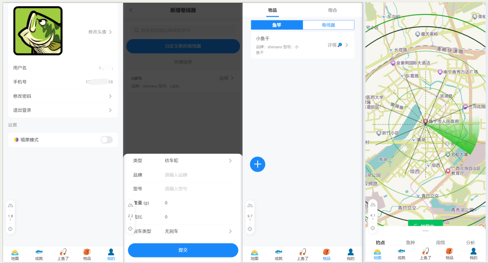

# 路亚记

v2 分支， 前后端分离

“路亚记”是一个路亚活动记录应用，旨在帮助路亚爱好者管理和优化他们的路亚体验。
用户可以通过这个应用注册和登录，管理个人信息，创建并维护一个包含鱼竿和卷线器的个人背包。
此外，用户还能根据背包内的装备创建钓鱼组合，记录详细的钓鱼活动，包括时间、地点、天气条件以及钓鱼成果。
应用还提供了钓点管理功能，允许用户查看和添加新的钓点。
同时还包括一个鱼类图鉴，用户可以通过添加记录来解锁不同的鱼类以及尺寸大小。

## 表结构

## License

[MIT](./LICENSE) License
