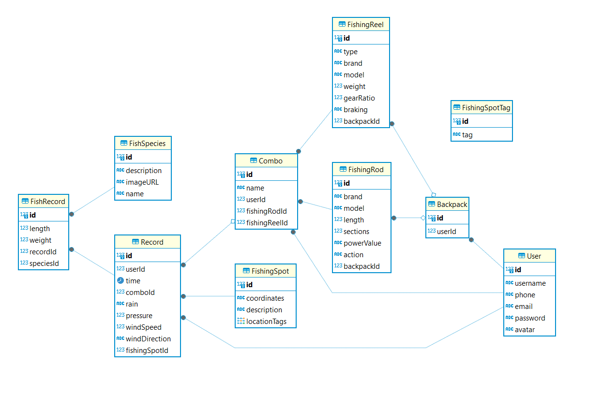

# 路亚记

“路亚记”是一个路亚活动记录应用，旨在帮助路亚爱好者管理和优化他们的路亚体验。用户可以通过这个应用注册和登录，管理个人信息，创建并维护一个包含鱼竿和卷线器的个人背包。此外，用户还能根据背包内的装备创建钓鱼组合，记录详细的钓鱼活动，包括时间、地点、天气条件以及钓鱼成果。应用还提供了钓点管理功能，允许用户查看和添加新的钓点。同时还包括一个鱼类图鉴，用户可以通过添加记录来解锁不同的鱼类以及尺寸大小。

## 表结构

### 用户 (`User`)

用户实体包含用户的基本信息和与钓鱼活动相关的数据。

字段说明：

- `id`: 用户的唯一标识。
- `username`: 用户名，唯一。
- `phone`: 用户的电话号码，唯一。
- `email`: 用户的电子邮件地址，可选，唯一。
- `password`: 用户的密码。
- `backpack`: 用户的背包，包含钓鱼装备。
- `combos`: 用户定义的钓鱼组合。
- `records`: 用户的钓鱼活动记录。

### 背包 (`Backpack`)

背包实体包含用户所拥有的钓鱼装备。

字段说明：

- `id`: 背包的唯一标识。
- `userId`: 关联的用户 ID。
- `fishingRods`: 背包中的鱼竿集合。
- `fishingReels`: 背包中的卷线器集合。

### 组合 (`Combo`)

组合实体表示用户为特定钓鱼活动预设的装备组合。

字段说明：

- `id`: 组合的唯一标识。
- `name`: 组合的名称。
- `userId`: 创建该组合的用户 ID。
- `fishingRodId`: 使用的鱼竿 ID。
- `fishingReelId`: 使用的卷线器 ID。
- `Record`: 与该组合关联的钓鱼记录。

### 鱼竿 (`FishingRod`)

鱼竿实体描述了鱼竿的详细规格。

字段说明：

- `id`: 鱼竿的唯一标识。
- `brand`: 品牌。
- `model`: 型号。
- `length`: 长度，单位为米。
- `sections`: 分段数。
- `powerValue`: 功率等级。
- `action`: 弯曲程度。

### 卷线器 (`FishingReel`)

卷线器实体描述了卷线器的详细规格。

字段说明：

- `id`: 卷线器的唯一标识。
- `type`: 卷线器类型。
- `brand`: 品牌。
- `model`: 型号。
- `weight`: 重量，单位为克。
- `gearRatio`: 齿轮比。
- `braking`: 刹车系统类型。

### 记录 (`Record`)

记录实体包含了一次钓鱼活动的详细数据。

字段说明：

- `id`: 记录的唯一标识。
- `userId`: 用户 ID。
- `time`: 钓鱼时间。
- `comboId`: 使用的装备组合 ID。
- `rain`: 降雨情况。
- `pressure`: 气压。
- `windSpeed`: 风速。
- `windDirection`: 风向。
- `fishingSpotId`: 钓点 ID。

### 钓点 (`FishingSpot`)

钓点实体包含了钓点的详细描述和位置信息。

字段说明：

- `id`: 钓点的唯一标识。
- `coordinates`: 坐标。
- `locationTag`: 地点标签。
- `description`: 描述。

### 渔获记录 (`FishRecord`)

渔获记录实体包含了单次钓鱼活动中的具体渔获数据。

字段说明：

- `id`: 渔获记录的唯一标识。
- `species`: 鱼种。
- `length`: 长度，单位为厘米。
- `weight`: 重量，单位为克。

## API 设计

### 用户管理 (User Management)

#### 注册用户 (Register User)

- **POST** /users/register
- **输入：** 用户名、密码、电子邮件、电话
- **输出：** 注册状态、用户详情

#### 用户登录 (User Login)

- **POST** /users/login
- **输入：** 电子邮件、密码
- **输出：** 认证令牌（Token）

#### 获取用户信息 (Get User Info)

- **GET** /users/{userId}
- **需要认证**
- **输出：** 用户详情

#### 更新用户信息 (Update User Info)

- **PUT** /users/{userId}
- **需要认证**
- **输入：** 电话、密码（可选）
- **输出：** 更新状态

#### 删除用户 (Delete User)

- **DELETE** /users/{userId}
- **需要认证**
- **输出：** 删除状态

### 背包管理 (Backpack Management)

#### 查看背包内容 (View Backpack Contents)

- **GET** /backpacks/{userId}
- **需要认证**
- **输出：** 背包内的鱼竿和卷线器列表

#### 添加鱼竿到背包 (Add Fishing Rod to Backpack)

- **POST** /backpacks/{userId}/rods
- **需要认证**
- **输入：** 鱼竿 ID
- **输出：** 更新后的背包内容

#### 添加卷线器到背包 (Add Fishing Reel to Backpack)

- **POST** /backpacks/{userId}/reels
- **需要认证**
- **输入：** 卷线器 ID
- **输出：** 更新后的背包内容

#### 从背包中移除鱼竿 (Remove Fishing Rod from Backpack)

- **DELETE** /backpacks/{userId}/rods/{rodId}
- **需要认证**
- **输出：** 更新后的背包内容

#### 从背包中移除卷线器 (Remove Fishing Reel from Backpack)

- **DELETE** /backpacks/{userId}/reels/{reelId}
- **需要认证**
- **输出：** 更新后的背包内容

### 组合管理 (Combo Management)

#### 创建组合 (Create Combo)

- **POST** /combos/{userId}
- **需要认证**
- **输入：** 鱼竿 ID、卷线器 ID
- **输出：** 新创建的组合详情

#### 查看用户组合 (View User Combos)

- **GET** /combos/{userId}
- **需要认证**
- **输出：** 用户的所有组合

#### 删除组合 (Delete Combo)

- **DELETE** /combos/{comboId}
- **需要认证**
- **输出：** 删除状态

### 钓鱼记录 (Fishing Records)

#### 记录钓鱼活动 (Log Fishing Activity)

- **POST** /records
- **需要认证**
- **输入：** 用户 ID、组合 ID、时间、天气、钓点 ID、其他气象数据
- **输出：** 新记录的详情

#### 查看钓鱼记录 (View Fishing Records)

- **GET** /records/{userId}
- **需要认证**
- **输出：** 用户的所有钓鱼记录

#### 更新钓鱼记录 (Update Fishing Record)

- **PUT** /records/{recordId}
- **需要认证**
- **输入：** 记录相关的任何可更新字段
- **输出：** 更新后的记录详情

#### 删除钓鱼记录 (Delete Fishing Record)

- **DELETE** /records/{recordId}
- **需要认证**
- **输出：** 删除状态

### 钓点和鱼类图鉴管理 (Fishing Spots and Fish Species Management)

#### 添加钓点 (Add Fishing Spot)

- **POST** /spots
- **输入：** 坐标、位置标签、描述
- **输出：** 新创建的钓点详情

#### 查看所有钓点 (View All Fishing Spots)

- **GET** /spots
- **输出：** 所有钓点列表

#### 添加鱼类信息 (Add Fish Species Info)

- **POST** /fishes
- **输入：** 鱼种名称、描述、图片 URL
- **输出：** 新添加的鱼类详情

#### 查看所有鱼类信息 (View All Fish Species Info)

- **GET** /fishes
- **输出：** 所有鱼类信息列表
